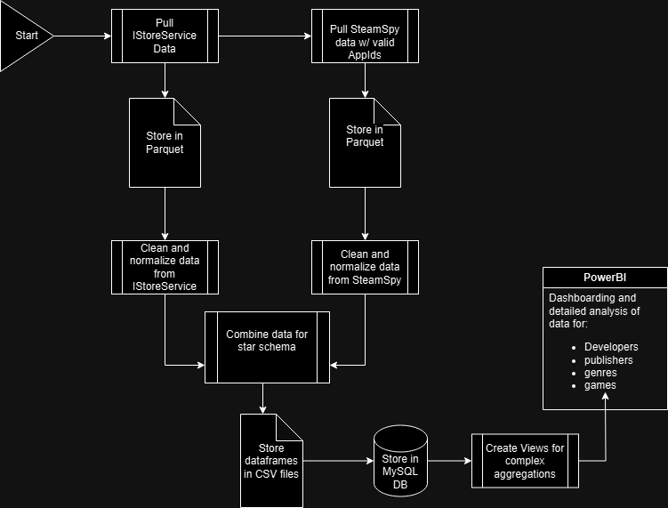
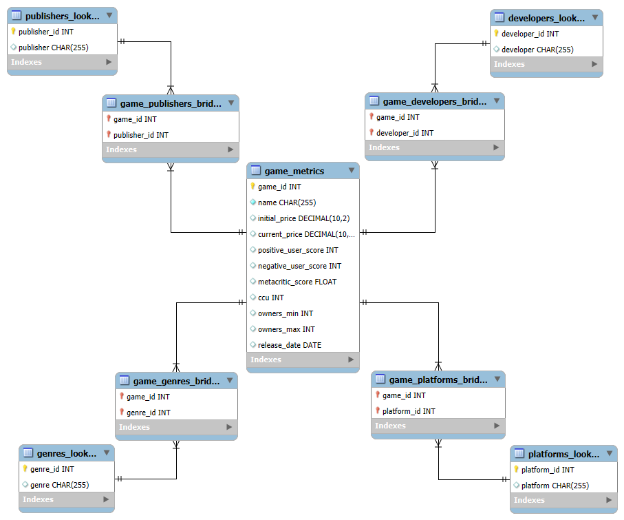
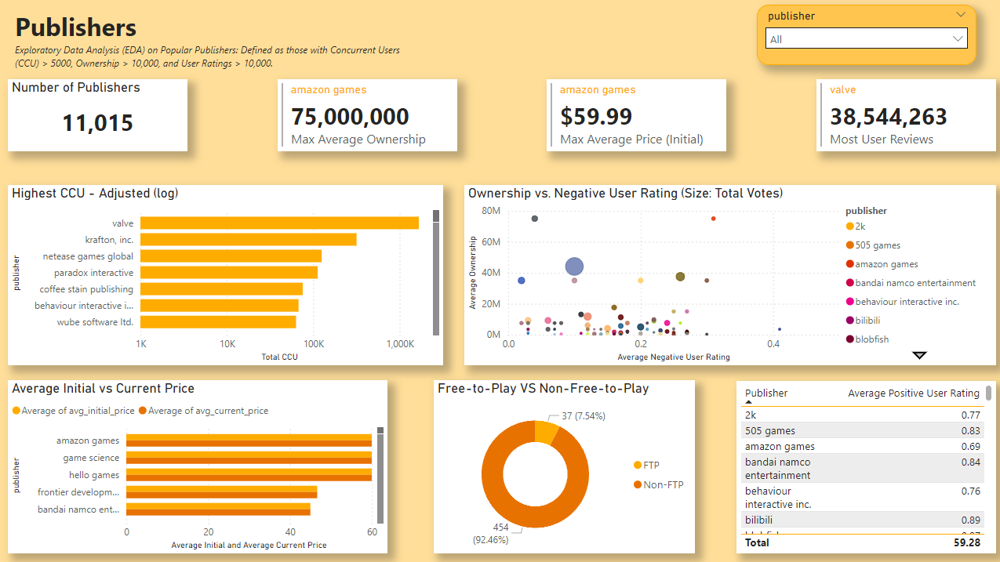
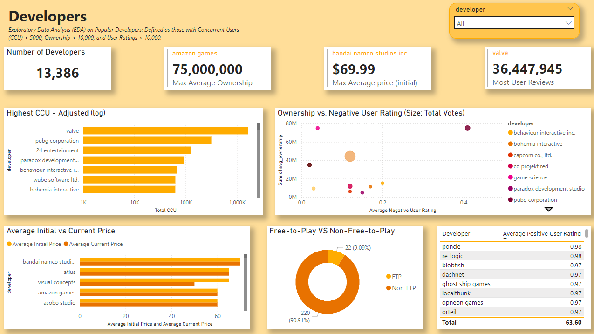
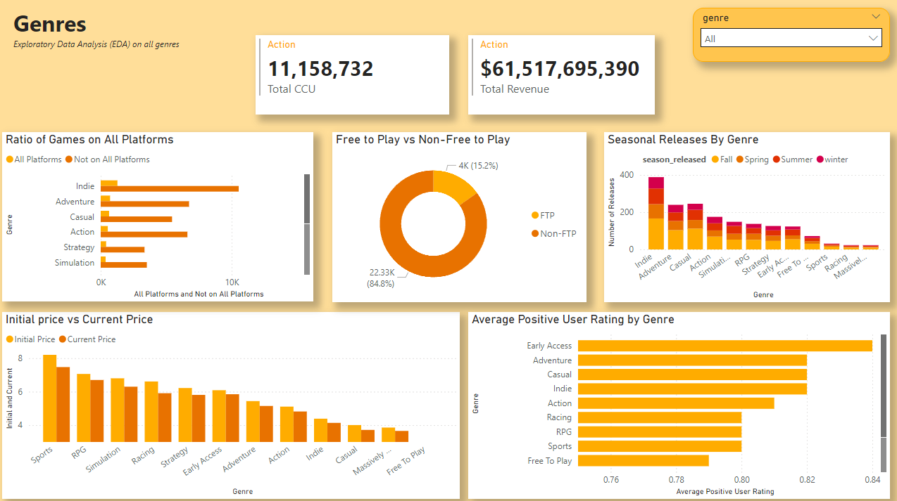
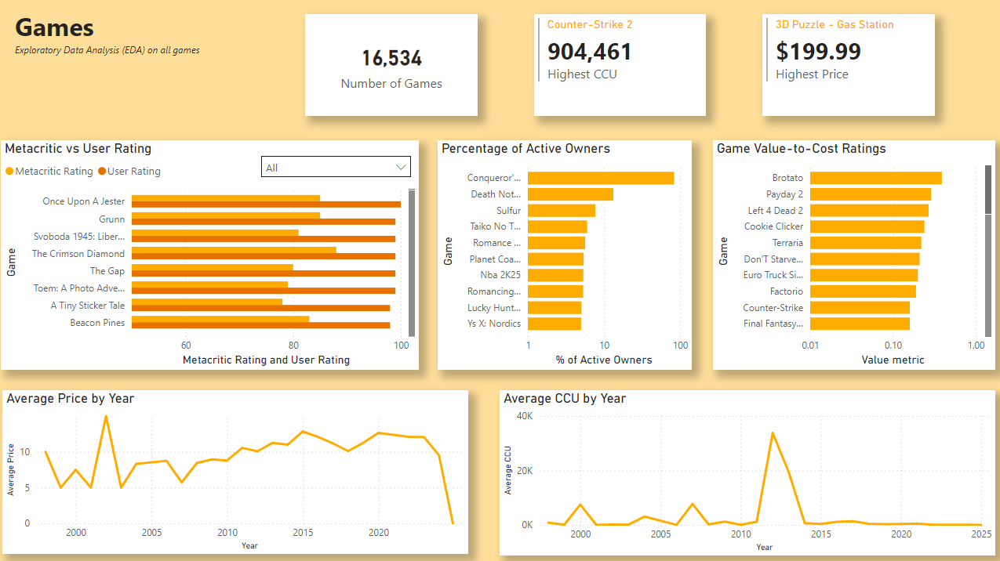

# Steam Game Data Analysis Project

---

## Overview
This project involves end-to-end data engineering and analysis of Steam gaming data for games actively being updated within 30 days of 11/12/2024. By leveraging APIs, cleaning and normalizing data, designing a star schema database, and creating insightful dashboards, I explored trends, pricing strategies, and user behaviors in the gaming market.

---

## Data Collection
- **Over 18,000 records** pulled from two APIs:
  1. **SteamPowered IStoreService API**: Collected foundational game data, including AppIDs.
  2. **SteamSpy API**: Used successful AppIDs to fetch additional insights like user scores, ownership data, and concurrent users (CCU).
- Stored raw data in **parquet files** for efficient storage and retrieval.

---

## Data Cleaning and Normalization
Key steps in cleaning and normalizing the data included:
- **Handling Lists**: Split multiple entries within single fields (e.g., genres, platforms).
- **Normalization**:
  - Converted non-ASCII characters in titles, developer, and publisher names.
  - Standardized date formats and genre language.
- **Addressing Missing Data**:
  - Compared pricing data from both APIs to fill gaps.
  - Normalized unreleased games (set release date to **January 1, 2025**, and prices to `-1`).
- **Data Types**: Ensured columns were properly typed.
- Cleaned data was saved in **CSV files**.

---

## Database Design
- Created a **star schema** database with bridge tables for:
  - **Developers**
  - **Publishers**
  - **Genres**
- Uploaded cleaned data into a **SQL database**.
- Created SQL views for aggregations to simplify Power BI analysis.

---

## Data Analysis and Dashboards

### Publishers and Developers:
- **Price Comparisons**: Current vs. initial pricing.
- **User Ratings**: Positive vs. negative correlations.
- **Top Performers**: Games with the highest concurrent users (CCU).

### Genres:
- **Revenue Insights**: Total revenue and CCU by genre.
- **Seasonal Trends**: Popularity over time.
- **Pricing Analysis**: Initial vs. current pricing.

### Games:
- **Metacritic vs. User Ratings**.
- **Game Value-to-Cost Metric**: Evaluated cost-effectiveness based on CCU, positive ratings, and price.

---

## Challenges
- **API Discrepancies**: Addressed mismatched pricing data by comparing sources.
- **Rate Limits:** Both APIs had strict rate limits, requiring a total of 12 hours to collect data from approximately 18,000 records.
- **Data Complexity**: Standardized genres and platforms across multiple languages.
- **Schema Design**: Balanced flexibility and performance for large datasets.

---

## Results
- **Interactive Dashboards**: Delivered actionable insights for stakeholders.
- **Scalable Pipeline**: Designed a reusable pipeline for analyzing gaming data.

---

## Key Technologies Used
- **Languages**: Python, SQL
- **Libraries**: Pandas, Requests
- **Database**: MySQL
- **Visualization**: Power BI
